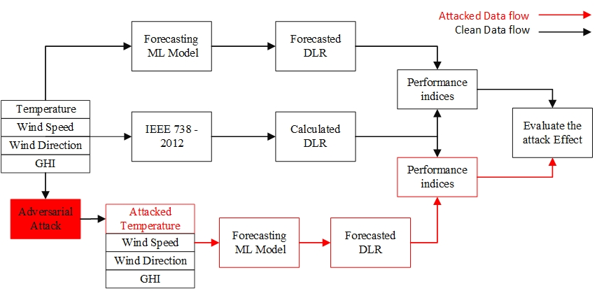
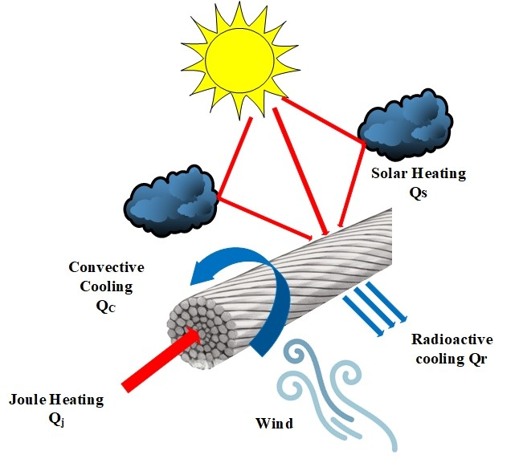
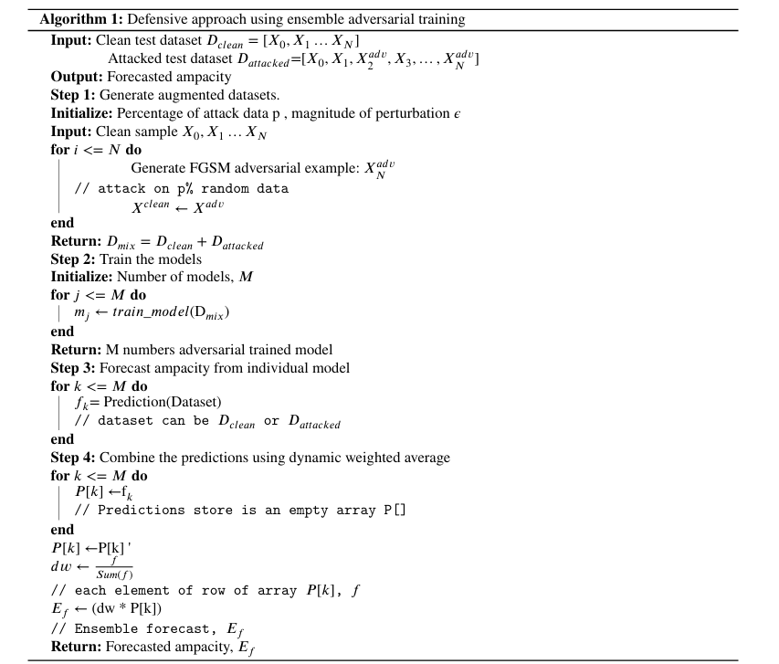

# **Ensemble Adversarial Training-Based Robust Model for Multi-Horizon Dynamic Line Rating Forecasting Against Adversarial Attacks**  

  

## **Table of Contents**  
- [Overview](#overview)  
- [Key Contributions](#key-contributions)  
- [Dataset](#dataset)
- [IEEE 738-2012 Standard](#ieee-738-2012-standard) 
- [Methodology](#methodology)  
  - [Forecasting Models](#1-forecasting-models)  
  - [Adversarial Attacks](#2-adversarial-attacks)  
  - [Defense Strategy: Ensemble Adversarial Training (EAT)](#3-defense-strategy-ensemble-adversarial-training-eat)
- [Summary of Results](#Summary-of-Results)
- [Citation](#citation)  
- [Installation & Usage](#installation--usage)  

## **Overview**  
This repository contains the implementation of an [Ensemble adversarial training (EAT)-based robust forecasting model for multi-horizon dynamic line rating (DLR) against adversarial attacks](https://github.com/Najmul1801098/Adversarial-attack-on-DLR/blob/main/Adversarial_attack_resilient_dynamic_line_rating_forecasting%20%5BFinal%5D.pdf). The study explores vulnerabilities in DLR forecasting due to adversarial manipulations and proposes a resilient forecasting approach leveraging ensemble learning techniques. 

## **Key Contributions**  
- Introduces an **ensemble adversarial training (EAT)**-based approach for **multi-horizon dynamic line rating (DLR) forecasting**.  
- Uses **XGBoost, CatBoost, and Random Forest** as base models.  
- Investigates vulnerabilities using **FGSM and BIM adversarial attack models**.  
- Proposes a **robust forecasting method** to mitigate adversarial impacts.  
- Evaluates model performance under **normal, attacked, and mitigated conditions** using RMSE and MAPE.  

## **Dataset**  
- **Source:** Meteorological and grid parameter data from [**Trang-Thap Cham 220 kV overhead transmission line**](https://github.com/Najmul1801098/Adversarial-attack-on-DLR/tree/main/Data).  
- **Features:**  
  - Ambient Temperature  
  - Wind Speed  
  - Wind Direction  
  - Global Horizontal Irradiance (GHI)  
- **Dynamic Line Rating Calculation:** Based on **IEEE 738-2012 standard**.  
## **IEEE 738-2012 Standard**  
The **IEEE 738-2012 Standard** provides a comprehensive framework for determining the **current-temperature relationship** of overhead transmission lines. It plays a crucial role in **Dynamic Line Rating (DLR)** by taking into account the real-time influence of meteorological parameters.   


## **Methodology**  
### **1. Forecasting Models**  
The following machine learning models are used for DLR forecasting:  
- **XGBoost:** Gradient boosting-based decision tree model.  
- **CatBoost:** Handles categorical features efficiently, used as the optimal model.  
- **Random Forest:** Ensemble learning with multiple decision trees.  

### **2. Adversarial Attacks**  
We implement **black-box adversarial attacks** on DLR forecasting models:  
- **FGSM (Fast Gradient Sign Method)** – Generates perturbations in a single step.  
- **BIM (Basic Iterative Method)** – Iteratively refines perturbations for stronger attacks.  
- **Attack Focus:** Manipulation of temperature data to disrupt DLR predictions.  

### **3. Defense Strategy: Ensemble Adversarial Training (EAT)**  
- **Multiple adversarial-trained models** combined for robust forecasting.  
- **Dynamic Weighted Averaging (DWA)** used to balance clean and attacked data.  
- **Significantly reduces error under attack scenarios**, ensuring stable grid operations.  

## **Summary of Results**  
The proposed **Ensemble Adversarial Training (EAT)-based model** significantly improves the robustness of **Dynamic Line Rating (DLR) forecasting** under adversarial attacks.  

- **Baseline Performance:** CatBoost outperformed other models in normal conditions, achieving the lowest RMSE and MAPE.  
- **Impact of Adversarial Attacks:** FGSM and BIM attacks severely degraded forecasting accuracy, increasing RMSE by up to **600%**.  
- **Effectiveness of EAT Defense:** The EAT-based approach successfully mitigated attack impacts, reducing error rates and restoring prediction accuracy close to pre-attack levels.  

**Conclusion:** The **EAT model enhances forecasting reliability**, ensuring stable grid operations even in adversarial environments.  

## **Citation**  
If you use this work, please cite:  

```bibtex
@article{ALAM2025111289,
title = {Ensemble adversarial training-based robust model for multi-horizon dynamic line rating forecasting against adversarial attacks},
journal = {Electric Power Systems Research},
volume = {241},
pages = {111289},
year = {2025},
issn = {0378-7796},
doi = {https://doi.org/10.1016/j.epsr.2024.111289},
url = {https://www.sciencedirect.com/science/article/pii/S0378779624011751},
author = {Najmul Alam and M.A. Rahman and Md. Rashidul Islam and M.J. Hossain}
}
```
## **Installation & Usage**  
1. **Clone the Repository:**  
   
bash
   git clone https://github.com/your-username/your-repository.git
   cd your-repository in this add table of content
